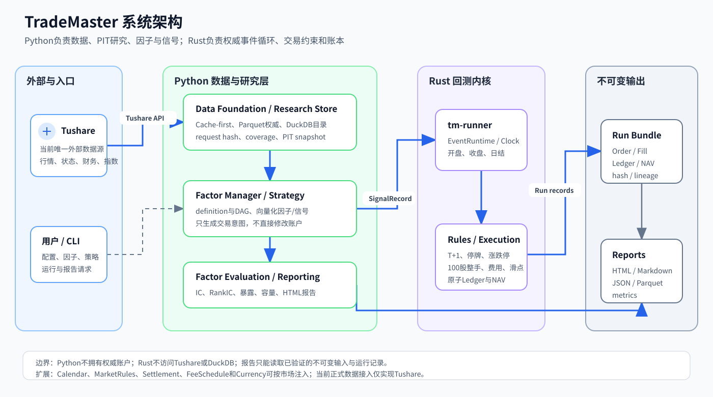
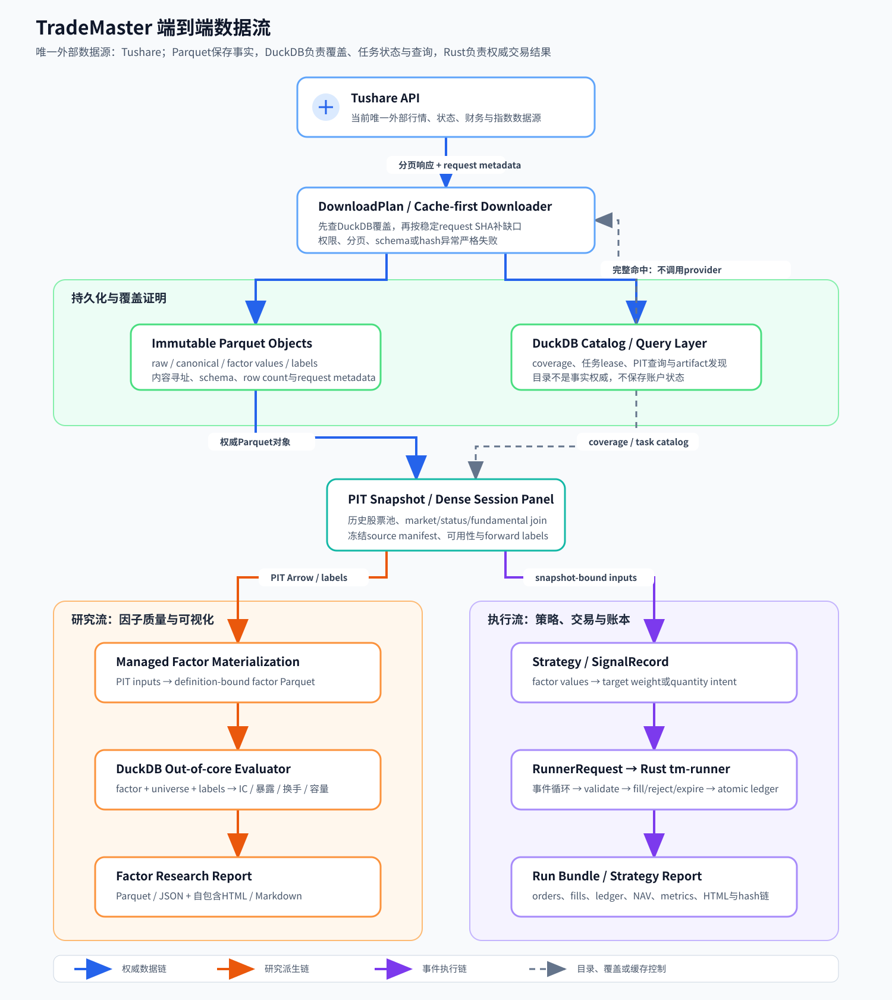

# TradeMaster

[](https://www.python.org/)
[](https://www.rust-lang.org/)
[](LICENSE)

面向A股研究的可复现因子与事件回测框架。TradeMaster使用Python完成Tushare数据采集、
Point-in-Time（PIT）查询、因子管理、信号生成和报告；使用Rust完成权威事件循环、A股交易
约束、成交和账本。

> 当前版本是research-first框架，不连接券商实盘，不提供投资建议。回测和因子统计不能保证
> 未来收益。

## 核心能力

- **Cache-first数据链**：先用DuckDB证明本地覆盖，只在缺口处请求Tushare；原始事实以
  内容寻址Parquet保存。
- **全A横截面研究**：支持历史上市/退市股票池、周/月调仓研究、稠密交易session面板和
  forward-return标签。
- **单标的与ETF事件回测底座**：信号可以表达目标权重或精确数量，由同一Rust事件内核执行。
- **A股交易规则**：T+1、停牌、涨跌停、100股整手、费用、滑点、拒单和过期均是显式合同。
- **因子管理**：definition/version、依赖DAG、代码/参数hash、Parquet物化、DuckDB发现和
  IC/RankIC/暴露/换手/容量评估。
- **可审计报告**：生成JSON、Parquet、自包含HTML和Markdown，报告绑定输入manifest与hash。
- **双路径研究模型**：Python提供向量化因子/信号与流式评估；不能向量化的交易逻辑通过
  Rust事件循环回放。账户和成交始终只有一套权威实现。

## 系统架构



[查看可编辑SVG原图](docs/architecture/trademaster-overview.svg) ·
[阅读详细架构说明](docs/architecture/overview.md)

核心边界：

- Python可以访问Tushare、Parquet和DuckDB，但不拥有权威账户；
- Rust只消费冻结的市场事件和策略意图，不读取Tushare token或研究数据库；
- `Fill`是唯一可以改变账本的事实，拒单和过期不会产生伪分录；
- 正式运行绑定source snapshot、factor definition、signals、orders、fills、ledger和report。

## 数据流转



[查看可编辑SVG原图](docs/architecture/trademaster-data-flow.svg)

```text
Tushare
  -> immutable Parquet objects
  -> DuckDB coverage/task catalog
  -> PIT snapshot / dense session panel
  -> Python factors and signals
  -> Arrow / RunnerRequest
  -> Rust event runtime
  -> orders / fills / ledger / NAV
  -> immutable bundle and reports
```

## 外部依赖与支持边界

### 外部数据服务

| 依赖 | 当前状态 | 用途 | 配置 |
|---|---|---|---|
| [Tushare Pro](https://tushare.pro/) | **唯一支持的数据源** | A股/ETF行情、交易日历、状态、涨跌停、财务、指数与行业数据 | 环境变量`TUSHARE_TOKEN` |

当前没有Wind、同花顺、聚宽、Qlib数据服务、交易所直连或券商API适配器。新增provider需要实现
相同的request identity、分页、coverage、PIT availability和不可变证据合同，不能只转换字段名。

Tushare接口受token积分、权限和频率限制。TradeMaster会区分权限阻塞、认证失败、无效请求和
瞬时网络错误；完整缓存命中时不会调用provider。请遵守Tushare自己的服务条款和数据授权。

### 本地运行依赖

| 依赖 | 最低版本/角色 |
|---|---|
| Python | 3.12；数据、因子、策略编排和报告 |
| Rust | 1.97；`tm-core`、`tm-engine`和`tm-runner` |
| DuckDB | 本地coverage目录、PIT查询和out-of-core评估 |
| Apache Arrow / Parquet | 子系统交换与权威列式对象 |
| Plotly | 自包含HTML可视化 |
| `uv` | 推荐的Python环境、锁文件和构建工具 |

DuckDB、Arrow、Parquet和Plotly是本地库，不是额外外部数据源。

## 安装

```bash
git clone https://github.com/Obscurepawn/TradeMaster.git
cd TradeMaster

# Python运行与开发依赖
uv sync --extra dev

# Rust事件内核
cargo build --release -p tm-runner
```

安装Python wheel：

```bash
uv build
uv pip install dist/trademaster-0.1.0-py3-none-any.whl
```

## 配置

不要把token写入代码、YAML、Parquet、日志或Git。推荐只在当前shell导出：

```bash
export TUSHARE_TOKEN="your-token"
```

| 配置 | 入口 | 说明 |
|---|---|---|
| Tushare token | `TUSHARE_TOKEN`或`--token-env` | 仅provider边界读取 |
| 数据根目录 | `--data-root` | Parquet对象、DuckDB目录和download plan |
| 报告/运行输出 | `--output-root`、`--report-root` | 不可变artifact和可视化报告 |
| 下载节流 | `--minimum-interval`、`--max-attempts` | API间隔和瞬时错误重试 |
| 研究区间/标的 | plan、panel和strategy参数 | 日期、benchmark、horizon和universe |
| Rust runner | `--runner`或stdin/stdout | `target/release/tm-runner` |

本地`data/`、`artifacts/`、`logs/`、`.env*`和token文件均已被`.gitignore`排除。

## 快速开始

### 1. 查看已管理因子

```bash
uv run tm-factor list
uv run tm-factor describe fundamental.roe@1
uv run tm-factor library-status
```

### 2. 创建可恢复的Tushare研究计划

先用较短区间验证权限和配额；全A长周期下载会产生大量API请求和本地数据。

```bash
uv run tm-research-full-a \
  --data-root data/research/demo \
  plan \
  --start 2024-01-01 \
  --end 2024-12-31 \
  --statement-start 2023-01-01
```

命令输出JSON中的`plan_sha256`是后续步骤的不可变计划身份：

```bash
export TM_PLAN_SHA="<plan_sha256>"

uv run tm-research-full-a \
  --data-root data/research/demo \
  download \
  --plan-sha256 "$TM_PLAN_SHA" \
  --max-tasks 100

uv run tm-research-full-a \
  --data-root data/research/demo \
  status \
  --plan-sha256 "$TM_PLAN_SHA"
```

重复执行`download`会从未完成task继续；已经验证的请求不会再次访问Tushare。

### 3. 构造全A研究面板

```bash
uv run tm-research-full-a \
  --data-root data/research/demo \
  materialize \
  --plan-sha256 "$TM_PLAN_SHA" \
  --output-root artifacts/research/demo/panel \
  --observation-frequency month_end \
  --horizons 1,5,20,60
```

记录输出的`manifest_sha256`，再运行流式因子评估：

```bash
export TM_PANEL_SHA="<panel_manifest_sha256>"

uv run tm-research-full-a \
  --data-root data/research/demo \
  evaluate \
  --plan-sha256 "$TM_PLAN_SHA" \
  --panel-output-root artifacts/research/demo/panel \
  --panel-manifest-sha256 "$TM_PANEL_SHA" \
  --factor-manifest-kind public \
  --report-root artifacts/research/demo/public-factor-report \
  --horizons 1,5,20,60
```

### 4. 调用Rust事件运行时

`tm-runner`从stdin读取严格JSON `RunnerRequest`，并把运行结果写到stdout：

```bash
target/release/tm-runner < runner-request.json > runner-result.json
```

请求必须满足共享schema、UTC时间、稳定排序、instrument和snapshot identity。Python E2E客户端
会负责构造请求、验证结果并生成bundle；协议细节见[schemas说明](schemas/README.md)。

## 仓库结构

```text
TradeMaster/
├── python/trademaster/   # 数据、PIT、因子、策略、E2E与报告
├── crates/
│   ├── tm-core/          # 精确类型、共享合同和artifact schema
│   ├── tm-engine/        # A股规则、成交、事件循环与账本
│   └── tm-runner/        # JSON stdin/stdout运行边界
├── schemas/              # 跨语言schema与wire说明
├── tests/                # Python合同、回归、真实cache与E2E测试
├── docs/                 # 公开架构、因子和全A研究文档
├── specs/                # 持久化里程碑规格与决策记录
├── Cargo.toml            # Rust workspace
└── pyproject.toml        # Python package与CLI
```

大规模市场数据、回测产物和外部框架调研仓库不提交到Git；它们分别位于本地`data/`、
`artifacts/`和`research/`。

## 验证

```bash
# Python
uv run pytest -q
uv run ruff check python tests
uv run mypy --strict python

# Rust
cargo fmt --all -- --check
cargo clippy --workspace --all-targets -- -D warnings
cargo test --workspace

# Package
uv build
```

需要真实Tushare的测试从环境变量读取token；缓存完整性测试可以在不访问网络的情况下运行。

## 文档

- [详细运行时架构](docs/architecture/overview.md)
- [因子管理与评估](docs/factor-management.md)
- [全A研究链路](docs/full-a-factor-research.md)
- [公开因子库状态](docs/public-factor-library.md)
- [开发规格索引](specs/INDEX.md)
- [Agent协作规范](AGENTS.md)

## 当前限制

- 正式数据provider目前只有Tushare；港股和美股只预留市场policy接口，尚未完成数据适配。
- 当前执行模型是日频/bar级，不模拟逐笔成交、订单簿排队或市场冲击曲线。
- Rust公司行动、拆并股和现金分红事件仍需增强；连续复权价策略只能作为研究近似。
- 历史行业、ST和部分状态数据受Tushare权限与源历史限制；正式运行遇到无法证明的缺口会
  fail closed。
- 因子forward return是研究标签，不等于经过涨跌停、停牌和退出延迟回放的策略收益。

## 参与开发

1. 阅读根[AGENTS.md](AGENTS.md)和[specs/INDEX.md](specs/INDEX.md)；
2. 行为变更先冻结公开合同并使用Red-Green-Refactor；
3. 保持Parquet权威、DuckDB只作目录，避免把未来信息回填到PIT研究；
4. 提交前运行相关Python/Rust门禁，并同步README、docs和spec。

欢迎通过Issue或Pull Request提交可复现问题、数据契约改进和新市场适配。

## License

TradeMaster基于[Apache License 2.0](LICENSE)发布。
