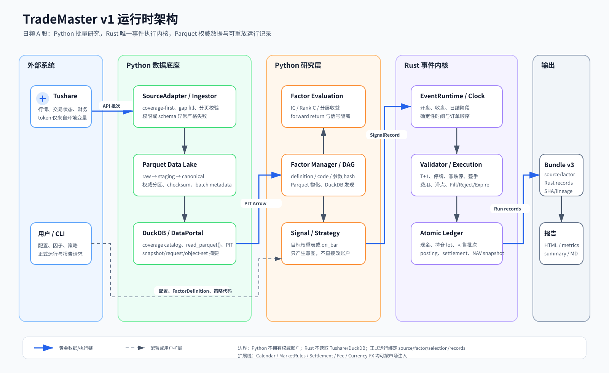

# TradeMaster v1 运行时架构

## 一句话模型

TradeMaster 从 Tushare 增量取得当时可见的数据，以 Parquet 保存权威事实、DuckDB 规划覆盖与
PIT 查询；Python 因子管理层以代码、参数和依赖内容寻址，物化并评估因子后生成信号；唯一的
Rust 事件内核执行 A 股规则、成交和账本，最后从带完整数据—因子—策略血缘的不可变bundle
重建指标和报告。

## 系统边界

- Python 数据层是唯一允许访问 Tushare、DuckDB 和数据湖的运行单元。
- Python 研究层只产生 `SignalRecord` 或实现受限的 `EventStrategy`，不拥有权威账户。
- 因子definition绑定代码、参数和依赖hash；因子值以Parquet为权威存储，独立DuckDB catalog
  只提供definition/materialization/evaluation发现，不保存权威因子值。
- forward returns只能进入evaluation namespace，不能回流factor或signal context。
- Rust 内核只消费已经绑定 snapshot 的市场事件和策略意图，不自行补数据或读取凭据。
- 报告层消费标准 run artifacts；切换 benchmark 不得改变订单、成交或账本。
- 所有运行产物携带 `run_id/event_seq` 与必要的子序号，按冻结排序键持久化和重放。
- snapshot 查询表的 metadata 绑定 snapshot/request/object-set 三个摘要；正式读取还会校验表内
  `event_time <= as_of`，不能靠调用者只贴一个 ID 绕过 PIT。
- 十一类 run Parquet（含账户状态哈希链）先经过 completed-run 跨表验证，再由实际文件 SHA/row count/run_id 生成
  `RunManifest`；报告读取时重复验证该完整性链。
- 策略级正式运行使用E2E bundle v3，同时绑定候选输入snapshot、factor definitions、父子DAG、
  factor materializations/Parquet、selection、Rust request/result、HTML、summary与Markdown。
- 行业/市值暴露按事件时间选择当时有效的classification；禁止用最后一次分类倒灌历史。
- 海外扩展通过 `Calendar`、`MarketRules`、`SettlementPolicy`、`FeeSchedule`、币种与 FX
  数据接口注入；Rust 事件循环和 artifact 合同不硬编码 SSE/SZSE 日历。

## 代表性黄金链路

以“周五收盘按 60 日动量选择 Top 20，下一交易日开盘调仓”为例：

1. `DataPortal.snapshot()` 把规范化请求、逐数据集完整覆盖证明、可用性策略及对应
   Parquet 对象共同写入内容寻址 manifest，固定日线、证券状态、涨跌停和停复牌。
2. `ManagedFactorRegistry`验证typed dependencies和无环DAG；`FactorManager`以definition、
   input snapshot、精确输入表、universe/range和父materialization生成稳定缓存键。
3. 因子Parquet经hash、Schema、行数和metadata复读验证；策略只从已验证的复合因子中选择标的，
   不在策略包内重复实现winsorize、z-score或指标方向。
4. `SignalRecord.signal_time` 为周五收盘，`eligible_execution_time` 为下一交易日开盘。
5. Rust/Python 策略视图都显式携带开盘、收盘或日结阶段；事件内核在开盘事件按先卖后买、
   同方向按instrument ID的稳定顺序生成订单，经济结果不依赖signal ID。
6. `Fill` 才能改变账本；拒绝和过期保留原因但不改账，合法 no-op 由空 `LedgerEffect`
   表达，不生成伪分录。
7. 日结解锁 T+1 可售批次，生成不可变 `LedgerPosting` 和包含持仓、lot、NAV 的
   `AccountSnapshot`；三者分别落到冻结的运行产物。
8. 报告层从不可变 records 计算绩效、成本、事件时点暴露和 benchmark 对比；因子评估独立输出
   IC、RankIC、分层收益、long-short spread和quantile turnover。

## 失败边界

- DuckDB coverage 证明有缺口时才请求 Tushare；权限不足、分页不完整和 schema 漂移中止任务。
- 缺 bar 且存在停牌证据时是不可交易；缺 bar 而无证据时是数据错误。
- 执行日缺少精确涨跌停/状态证据时终止正式运行，不能合成宽松边界继续成交。
- ETF若数据源不提供逐日limit表，只允许使用显式版本化、写入runner evidence的交易所limit rule；
  既没有状态行也没有规则证据时同样终止。
- 同一factor ID/version若代码或参数hash变化必须升级version；缓存损坏、definition冲突或父DAG
  缺失时fail closed。
- T 日收盘信号不能在 T 日收盘成交。
- 账本应用失败必须原子回滚，不能留下半笔现金或仓位变化。
